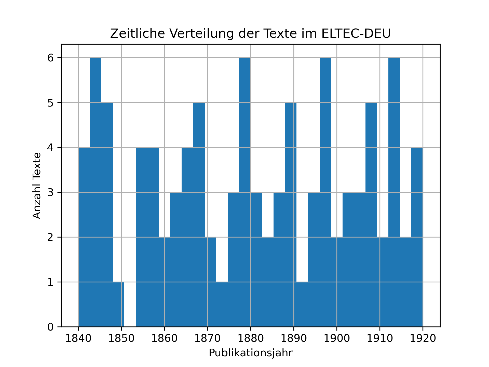

---
jupytext:
  formats: md:myst
  text_representation:
    extension: .md
    format_name: myst
kernelspec:
  display_name: Python 3
  language: python
  name: python3
---

# Auswahl des Forschungskorpus

Diese Fallstudie untersucht, wie deutschsprachige literarische Texte des 19. Jahrhunderts die abnehmende Luftqualität reflektieren und diskursivieren.  
Ein zentraler Schritt besteht darin, ein geeignetes **Forschungskorpus** auszuwählen, das den historischen Zeitraum und die thematische Breite unserer Forschungsfrage abdeckt.

Im Unterschied zur vorherigen Fallstudie, in der das Korpus selbst aufgebaut wurde, liegt der Fokus hier auf der **reflektierten Auswahl** eines bestehenden Korpus.

````{admonition} Lernziel
:class: keypoint
Nach diesem Abschnitt können Sie die Kriterien für die Auswahl eines geeigneten Forschungskorpus benennen, bestehende Korpora vergleichen und den Auswahlprozess datenbasiert begründen.
`````

---

## 1 Vom Aufbau zur Auswahl

Während in der Fallstudie 1 ein eigenes Zeitungskorpus zur Spanischen Grippe 1918/19 aufgebaut wurde, greifen wir in dieser Fallstudie auf bereits existierende digitale Korpora deutschsprachiger Prosa zurück. Wir stehen also nicht vor der Aufgabe, Texte selbst zu digitalisieren, sondern müssen reflektiert entscheiden, **welches existierende Korpus** für unsere Forschungsfrage geeignet ist.

Die im Kapitel [„Korpora als Forschungsobjekte“](corpus-collection_corpora-as-research-objects.md) beschriebenen Strategien – *Vollständigkeit, Repräsentativität, Balance* und *Opportunismus* – bilden dabei unseren Bewertungsrahmen {cite:p}`schoech2017`.

---

## 2 Vorhandene Korpora deutschsprachiger Prosa

Im Folgenden werden drei frei verfügbare Korpora vorgestellt, die sich für literaturwissenschaftliche Analysen deutscher Prosa eignen. Konkret wurden für diese Fallstudie das [d-Prose-Korpus](https://zenodo.org/records/5015008), das [Corpus of German-Language Fiction](https://figshare.com/articles/dataset/Corpus_of_German-Language_Fiction_txt_/4524680) sowie das [German ELTeC-Korpus](https://zenodo.org/records/4662482) herangezogen.

| Korpus                                                                                                                                   | Beschreibung                                 | Zeitraum  | Format    | Auswahlstrategie             | Stärken                                            | Schwächen                            |
| ---------------------------------------------------------------------------------------------------------------------------------------- | -------------------------------------------- | --------- | --------- | ---------------------------- | -------------------------------------------------- | ------------------------------------ |
| **d-Prose 1870–1920** ([Zenodo](https://zenodo.org/records/5015008))                                                                     | ca. 150 Werke, TEI/XML, kuratiert            | 1870–1920 | TEI/XML   | balanciert                   | gute Metadaten, literaturwissenschaftlich gepflegt | begrenzter Zeitraum                  |
| **Corpus of German-Language Fiction** ([Figshare](https://figshare.com/articles/dataset/Corpus_of_German-Language_Fiction_txt_/4524680)) | ca. 1 200 Romane in Plain Text mit Metadaten | 1750–1950 | TXT | opportunistisch / balanciert | großer Umfang, gute zeitliche Abdeckung            | uneinheitliche Metadaten, OCR-Fehler |
| **ELTeC-German** ([Zenodo](https://zenodo.org/records/4662482))                                                                          | ca. 100 Werke, nach ELTeC-Samplingprotokoll  | 1840–1920 | TEI/XML   | repräsentativ                | methodisch solide, Gender-Balance                  | relativ klein, Lücken vor 1840       |

```{admonition} Hinweis
:class: tip
Bereits in dieser Übersicht zeigt sich, dass kein Korpus „perfekt“ ist. 
Die Entscheidung für ein Korpus hängt immer vom Zusammenspiel zwischen Forschungsfrage, zeitlicher Abdeckung, Datenqualität und praktischer Zugänglichkeit ab.
```

---

## 3 Explorative Analyse der Metadaten

Um die Eignung der Korpora genauer zu prüfen, untersuchen wir zunächst ihre Metadaten.
Ziel ist es, **ein erstes Gefühl für die zeitliche Verteilung, Vollständigkeit und Struktur** der Daten zu gewinnen.

### 3.1 Laden und Erkunden der Metadaten

```python
import pandas as pd
import matplotlib.pyplot as plt

# Beispiel: Metadaten des ELTeC-German
meta = pd.read_csv("https://zenodo.org/records/4662482/files/metadata.csv")
meta['year'] = meta['year'].astype(int)

meta.head()
```

### 3.2 Zeitliche Verteilung

```python
meta['year'].hist(bins=30)
plt.xlabel("Publikationsjahr")
plt.ylabel("Anzahl Texte")
plt.title("Zeitliche Verteilung der Texte im ELTEC-DEU")
plt.show()
```


```{admonition} Interpretation
:class: hint
Wie gleichmäßig ist die zeitliche Verteilung?
Sind bestimmte Jahrzehnte über- oder unterrepräsentiert?
```

### 3.3 Weitere Explorationsideen

* Verteilung der Textlängen
* Geschlechterverhältnis der Autor:innen (falls vorhanden)
* Anteil von Texten aus dem 19. Jahrhundert
* Vergleich mehrerer Korpora nebeneinander

---

## 4 Bewertung und Entscheidung

Die explorative Analyse erlaubt nun eine systematische Bewertung entlang der Kriterien von {cite:p}`schoech2017`.

| Kriterium           | ELTeC-German | d-Prose 1870–1920 | Corpus of German Fiction |
| ------------------- | ------------ | ----------------- | ------------------------ |
| Zeitliche Abdeckung | mittel       | gering            | hoch                     |
| Datenqualität       | hoch         | hoch              | mittel                   |
| Repräsentativität   | hoch         | mittel            | gering                   |
| Umfang              | klein        | mittel            | groß                     |
| Verfügbarkeit       | sehr gut     | gut               | gut                      |

```{admonition} Zwischenfazit
:class: keypoint
Das Corpus of German-Language Fiction bietet die größte zeitliche Breite und damit die besten Voraussetzungen, um Veränderungen im sprachlichen Diskurs über Luftqualität im 19. Jahrhundert zu untersuchen.
```

---

## 5 Sampling und Filterung des Korpus

Für die weitere Analyse konzentrieren wir uns auf den Zeitraum **1800–1900**.
Zudem möchten wir sicherstellen, dass jedes Jahrzehnt annähernd gleich stark vertreten ist.

```python
subset = meta.query("1800 <= year <= 1900")

# Optional: pro Jahrzehnt 10 Texte zufällig ziehen
subset_decades = (
    subset.groupby(subset['year']//10*10)
    .apply(lambda x: x.sample(n=min(10, len(x)), random_state=42))
    .reset_index(drop=True)
)

subset_decades.to_csv("corpus_subset_metadata.csv", index=False)
```

```{admonition} Weiterführende Übung
:class: seealso
Versuchen Sie, eine eigene Filterung zu definieren – z. B. nur Texte, die in Großstädten spielen, oder nur Romane weiblicher Autorinnen.  
Solche Entscheidungen verändern das Erkenntnispotenzial des Korpus erheblich.
```

---

## 6 Reflexion: Auswahl als epistemische Entscheidung

Die Entscheidung für ein bestimmtes Korpus ist nie neutral.
Sie bestimmt, **welche literarischen Stimmen, Räume und historischen Kontexte** in der Analyse sichtbar werden.
Die bewusste Reflexion über diese Auswahl ist ein zentraler Bestandteil datenbasierter geisteswissenschaftlicher Forschung.

```{admonition} Merksatz
:class: keypoint
Mit der Auswahl eines Korpus konstruieren wir das epistemische Objekt unserer Forschung – und damit die Grenzen dessen, was wir erkennen können.
```

---

```{admonition} Weiterführende Links
:class: seealso
- [forTEXT-Artikel „Korpusbildung“](https://fortext.net/routinen/methoden/korpusbildung) {cite:p}`fortext-2020-id-203`  
- [ELTeC Documentation](https://www.distant-reading.net/eltec/)  
- [Corpus of German-Language Fiction (Fischer et al.)](https://figshare.com/articles/dataset/Corpus_of_German-Language-Fiction_txt_/4524680)
```

---

```{bibliography}
:filter: docname in ["fallstudie3_korpuswahl"]
```
